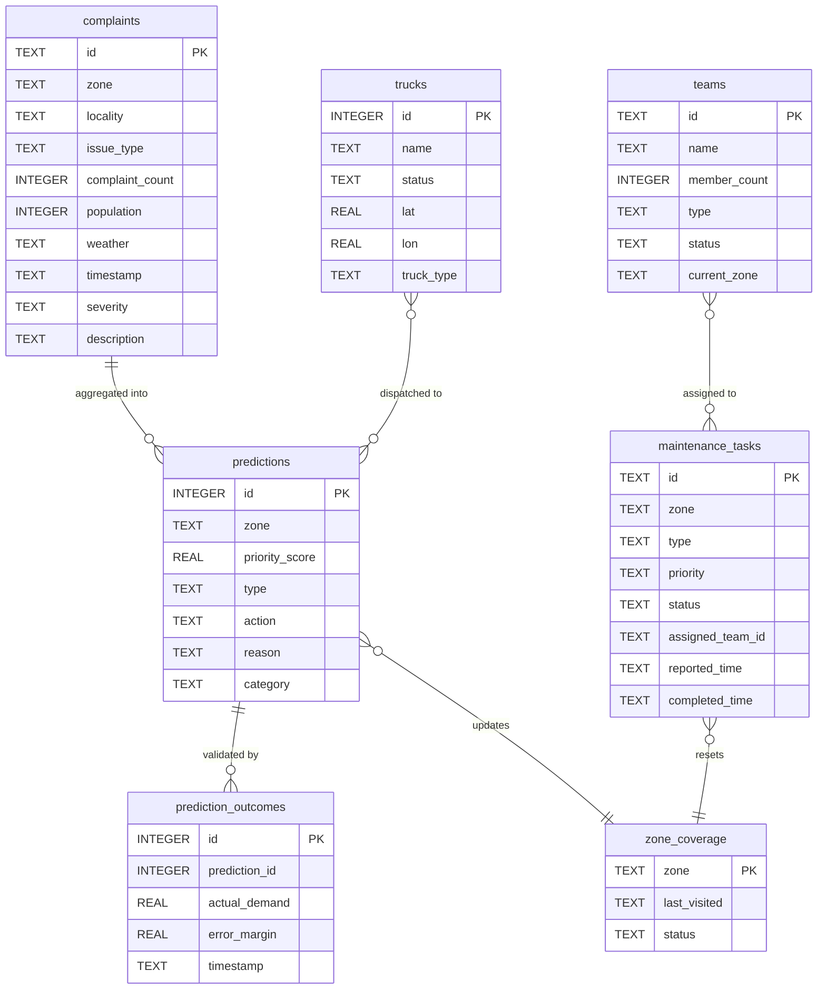

<div align="center">

# 🔧 NagarFlow — Backend Documentation

**Python 3.11 · Flask · SQLite · 25+ REST Endpoints · 1,609 LOC**

[← Back to Main README](README.md) · [Frontend Docs →](nagarflow-next/README.md)

</div>

---

## Overview

The NagarFlow backend is a single-process Flask application (`app.py`) that orchestrates:

- **Complaint ingestion** from WhatsApp, voice calls, and web chat
- **Multilingual NLU** via Gemini 2.5 Pro with keyword-based fallback
- **AiRLLM priority scoring** for 65+ Mumbai zones
- **Greedy fleet dispatch** using Haversine distance matching
- **Weather polling** from NOAA / Open-Meteo
- **Coverage gap detection** (48-hour overdue scanner)
- **Maintenance task generation** for high-priority zones
- **Feedback loop** tracking prediction error per dispatch

The entire backend runs with zero external infrastructure — no Redis, no Postgres, no Docker. Just Python + SQLite.

---

## Database Schema

All data resides in a single SQLite file: `nagarflow.db`

### Tables

| Table | Primary Key | Records | Purpose |
|:---|:---|:---|:---|
| `complaints` | `id` (TEXT) | 51,440+ | Citizen complaints with zone, locality, issue type, severity |
| `trucks` | `id` (INTEGER) | 15 | Fleet status, GPS position, truck type (garbage / water) |
| `predictions` | `id` (INTEGER) | 65+ | AiRLLM priority scores per zone |
| `prediction_outcomes` | `id` (INTEGER) | Growing | Actual demand vs. predicted — used for error tracking |
| `zone_coverage` | `zone` (TEXT) | 34 | Last visit timestamp and status (OK / OVERDUE) |
| `teams` | `id` (TEXT) | 10 | Maintenance teams (Alpha–Juliet) with specialization |
| `maintenance_tasks` | `id` (TEXT) | Dynamic | Auto-generated tasks for zones scoring > 80 |
| `agencies` | `id` (TEXT) | 10+ | Scraped Mumbai municipal agency directory |
| `global_status` | `key` (TEXT) | 1+ | Key-value store (current rain status) |

### Entity Relationship



---

## Core Modules

### `app.py` — Flask API Server

The main entry point. Initializes all database tables on startup (with automatic schema migration for older databases), registers CORS headers, and exposes 25+ REST routes.

**Key behaviors on startup:**
- Creates/migrates all 9 tables
- Auto-seeds zone coverage from `ZONE_ALIAS_MAP` (34 wards)
- Rebalances truck types (ensures water tankers exist)
- Seeds 10 maintenance teams (Alpha → Juliet)
- Runs initial agency scrape if `agencies` table is empty
- Deduplicates predictions table

### `airllm_engine.py` — Priority Scoring

The AiRLLM engine scores 65+ zones using a multi-factor formula:

```python
# 1. Logarithmic complaint scaling (prevents clumping)
log_complaints = log₁₀(max(1, complaints))

# 2. Zone stability seed (deterministic personality)
zone_volatility = MD5(zone_name) → random.uniform(-5, 5)

# 3. Base score calculation
raw_score = (log_complaints × 10) + zone_volatility
          + (20 if rain_status == 'Yes')
          + min(15, hours_since_visit / 4)

# 4. Global normalization (30-90% range)
scaled = 30 + ((raw - min_raw) / range) × 52

# 5. Voice override (emergency band)
if voice_complaint: score = random.randint(84, 90)
```

**Supports live LLM inference** via `AIRLLM_API_ENDPOINT` env var. Falls back to the heuristic simulator if not configured.

### `complaint_parser.py` — Gemini NLU

Single-prompt Gemini 2.5 Pro pipeline that:

1. Detects input language (Hindi / English / Hinglish)
2. Translates to standardized English
3. Extracts `{zone, specific_location, issue_type, severity}`
4. Detects call-ending phrases in Hindi/English
5. Generates native-language reply text

**34 valid zones** and **4 issue types** (Garbage, Drainage, Roads, Water) are provided in the prompt as constraints.

### `greedy_dispatcher.py` — Fleet Matching

Greedy algorithm:
1. Fetch top-5 priority zones from predictions
2. Fetch all idle trucks
3. For each zone: find nearest truck by type preference using Haversine
4. Calculate ETA at 30 km/h Mumbai street traffic speed
5. Remove matched truck from pool (prevent double-assignment)

```python
def haversine(lat1, lon1, lat2, lon2):
    R = 6371.0  # Earth radius in km
    # ... spherical distance calculation
```

### `preprocess_transformer.py` — LLM Prompt Builder

Aggregates cross-table data into structured text blocks for the LLM:

```
Zone: Dharavi. Hotspots: Cross Road (450), Kumbharwada (320). 
Total Complaints: 2340. Pop: 1000000. Keywords: garbage, drainage. 
Rain: yes. Last visited: 52 hours ago. Voice: no.
```

### `weather_poller.py` — NOAA Integration

- Polls Open-Meteo API every 15 minutes
- Checks WMO weather codes for precipitation:
  - Codes 61-67: Rain
  - Codes 80-82: Showers
  - Codes 95-99: Thunderstorm
- Writes `current_rain_status` to `global_status` table

### `sarvam.py` — Voice Processing

| Function | Sarvam Model | Purpose |
|:---|:---|:---|
| `speech_to_text()` | saaras:v3 | Hindi/English STT from audio buffer |
| `text_to_speech()` | bulbul:v3 | Native-language audio reply |
| `translate_to_english()` | sarvam-translate:v1 | Devanagari → English normalization |

### `localities.py` — Sub-locality Resolution

Contains 34 parent zones with 100+ sub-localities in both English and Hindi (Devanagari):

```python
SUB_LOCALITY_MAP = {
    "Andheri": [("Chakala", "चकाला"), ("Mogra", "मोगरा"), ...],
    "Bandra": [("Carter Road", "कार्टर रोड"), ("Pali Hill", "पाली हिल"), ...],
    # ... 34 zones
}
```

Resolution order:
1. Alias map match (exact + Devanagari)
2. Sub-locality match within detected zone
3. Cross-zone sub-locality scan
4. Suffix heuristic fallback (nagar, colony, station, road, etc.)

### `fleet_manager.py` — GPS Coordinates

Every zone has **verified land-only GPS coordinates** (checked against OpenStreetMap). Trucks initialize in 4 land clusters:

| Cluster | Lat Range | Lon Range | Area |
|:---|:---|:---|:---|
| South Mumbai | 18.92–18.99 | 72.80–72.84 | Colaba to Dadar |
| Western Suburbs | 19.05–19.20 | 72.82–72.86 | Bandra to Borivali |
| Central Suburbs | 19.00–19.09 | 72.84–72.88 | Kurla to Ghatkopar |
| Navi Mumbai | 19.00–19.10 | 73.00–73.05 | Vashi to Airoli |

---

## Full API Reference

### Complaint Endpoints

#### `GET /api/complaints`

Fetch complaints with optional filters.

| Parameter | Type | Description |
|:---|:---|:---|
| `area` | string | Filter by zone name |
| `type` | string | Filter by issue type |
| `severity` | string | Filter by severity level |
| `limit` | integer | Max results to return |

#### `POST /api/whatsapp-complaint`

Ingest a complaint from N8n / WhatsApp / Telegram.

**Request body:**
```json
{
  "zone": "Dharavi",
  "issue_type": "Garbage",
  "severity": "High",
  "description": "Garbage piled up near Cross Road"
}
```

#### `GET /api/hotspots`

Returns locality-level complaint density clusters for heatmap visualization.

---

### Prediction Endpoints

#### `GET /api/predictions`

Returns all zone priority scores with coordinates.

**Response:**
```json
[
  {
    "name": "Dharavi",
    "demand": 88,
    "type": "high",
    "action": "Immediate Dispatch Required",
    "reason": "2340 reports in Cross Road (450), Kumbharwada (320)",
    "lat": 19.0408,
    "lon": 72.8540,
    "category": "Garbage Collection"
  }
]
```

#### `GET /api/dashboard`

Combined payload for the operations dashboard.

**Response:**
```json
{
  "trucks": [
    { "id": 1, "name": "Truck-01", "status": "idle", "lat": 19.05, "lon": 72.83, "truck_type": "garbage", "truck_type_label": "Garbage Truck" }
  ],
  "predictions": [
    { "zone": "Dharavi", "priority_score": 88, "action": "...", "reason": "...", "lat": 19.04, "lon": 72.85 }
  ]
}
```

---

### Dispatch Endpoints

#### `GET /api/dispatch`

Returns top-5 Haversine-paired dispatch suggestions.

**Response:**
```json
[
  {
    "zone": "Dharavi",
    "priority_score": 88,
    "reason": "2340 reports in Cross Road",
    "action": "Immediate Dispatch Required",
    "truck_id": 3,
    "truck_name": "Truck-03",
    "truck_type": "garbage",
    "truck_type_label": "Garbage Truck",
    "distance_km": 1.24,
    "eta_mins": 3
  }
]
```

#### `POST /api/dispatch/accept`

```json
{ "truck_id": 3, "zone": "Dharavi" }
```
Updates truck status to `en_route_to_Dharavi`.

#### `POST /api/dispatch/arrive`

```json
{ "truck_id": 3, "zone": "Dharavi" }
```
- Resets truck to `idle`
- Updates zone coverage to `OK`
- Calculates `Error = |Predicted − Actual|` and writes to `prediction_outcomes`

#### `POST /api/simulate-surge`

Injects +35% demand spike into a random prediction for demo purposes.

---

### Simulation Endpoints

#### `GET /api/simulation/baseline`

Returns current prediction scores as simulation baseline.

#### `POST /api/simulation/run`

```json
{
  "demand": 40,
  "failures": 10,
  "weather": 2
}
```

**Response:**
```json
{
  "before": [{ "zone": "Dharavi", "priority_score": 65, "category": "Garbage Collection" }],
  "after": [{ "zone": "Dharavi", "priority_score": 89, "category": "Garbage Collection" }],
  "stats": {
    "coverage": 62.1,
    "response_time": 28,
    "overloaded": 12,
    "missed": 9.3
  }
}
```

---

### Maintenance Endpoints

#### `GET /api/maintenance/data`

Auto-generates tasks for zones scoring >80. Returns tasks + teams + stats.

#### `POST /api/maintenance/assign`

```json
{ "task_id": "T-A1B2", "team_id": "A1" }
```

#### `POST /api/maintenance/complete`

```json
{ "task_id": "T-A1B2" }
```
Resets team status, updates zone coverage, marks task `COMPLETED`.

---

### Reports & Weather

#### `GET /api/reports`

```json
{
  "kpis": { "accuracy": 78.8, "coverage": 84.6, "equity": 91.0, "efficiency": 84.5 },
  "trigger_retrain": false,
  "recent_error_margin": 12.3,
  "chart_data": {
    "accuracy_trend": [90, 92, 91, 93, 94, 91, 78.8],
    "coverage_trend": [80, 82, 85, 84, 87, 85, 84.6]
  }
}
```

#### `GET /api/weather/zones`

Returns per-zone weather data (deterministic for demo, based on zone hash):
- Temperature (27-36°C, coastal cooler)
- AQI (50-320, industrial wards higher)
- Wind speed (10-45 km/h, coastal windier)

#### `GET /api/agencies`

Serves cached agency directory from SQLite. Pass `?refresh=1` for live re-scrape.

---

### Voice Agent

#### `POST /api/agent/respond`

**Multipart form:** `audio` (file) + optional `source`

Pipeline: Audio → Sarvam STT → Gemini NLU → extract zone/issue/severity → insert complaint → Sarvam TTS → base64 audio reply

#### `POST /api/agent/respond-chat`

```json
{ "text": "Dharavi mein bohot kachra hai" }
```

Pipeline: Text → Gemini NLU → extract zone/issue/severity → insert complaint → text reply

---

## Initialization Scripts

Run these once after cloning to bootstrap the database:

| Script | Purpose | Run Order |
|:---|:---|:---|
| `python ingest_data.py` | Load 51,440 complaints from CSVs | 1st |
| `python fleet_manager.py` | Seed 15 trucks across 4 land clusters | 2nd |
| `python weather_poller.py` | Fetch current NOAA weather status | 3rd |
| `python coverage_gap.py` | Flag zones >48hr since last visit | 4th |
| `python airllm_engine.py` | Generate AiRLLM predictions for all zones | 5th |
| `python seed_full_demo.py` | Seed demo data for all tables (optional) | 6th |

---

## Environment Variables

| Variable | Required | Description |
|:---|:---|:---|
| `GEMINI_API_KEY` | ✅ | Google Gemini API key for NLU |
| `OPENAI_API_KEY` | Optional | For WhatsApp/Telegram N8n pipeline |
| `SARVAM_API_KEY` | Optional | For voice agent STT/TTS |
| `VAPI_WEBHOOK_SECRET` | Optional | For Vapi telephony integration |
| `AIRLLM_API_ENDPOINT` | Optional | Custom LLM endpoint (blank = heuristic fallback) |

---

<div align="center">

[← Main README](README.md) · [Frontend Docs →](nagarflow-next/README.md) · [Deployment →](DEPLOYMENT.md)

</div>
