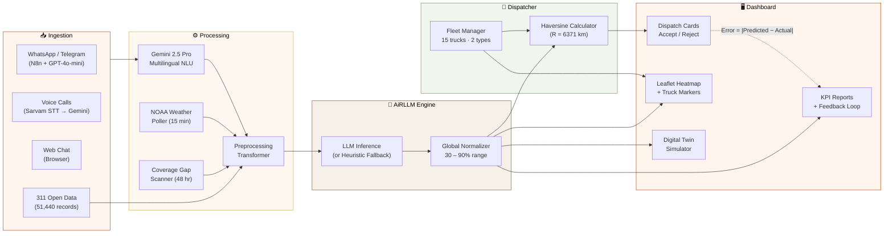

<div align="center">

)" width="72" alt="NagarFlow" />

# NagarFlow

### The city's brain. Predict. Dispatch. Learn.

AI-powered civic intelligence platform that predicts urban resource demand and optimizes<br/>real-time allocation of water tankers, garbage trucks, and maintenance teams across Mumbai.

<br/>

[](https://nagarflow.netlify.app/)
[](https://github.com/vinitgirdhar/nagarflow)
[](#)
<br/>
[](#-technology-stack)
[](#-technology-stack)
[](#-technology-stack)
[](#-data)

**Zero hardware · 48-hour forecast · Equity-first dispatch · Multilingual voice**

<br/>

[Overview](#-overview) · [Problem](#-the-problem) · [Architecture](#-system-architecture) · [Intelligence Modules](#-intelligence-modules) · [Screenshots](#-screenshots) · [Tech Stack](#-technology-stack) · [API Reference](#-api-reference) · [Getting Started](#-getting-started) · [Team](#-team)

<br/>


</div>

---

## 📋 Overview

**NagarFlow** is a full-stack civic intelligence platform that ingests citizen complaints from **WhatsApp**, **voice calls** (Hindi, English, Marathi), and a **web chat simulator** — then routes them through an AI pipeline to prioritize 65+ urban zones, match fleet assets via Haversine distance, and close the loop via prediction error tracking.

The system is deployed as a **decoupled monorepo** with two independently running services:

| Layer | Stack | What It Does |
|:---|:---|:---|
| **Frontend** | Next.js 16 · React 19 · Three.js · Leaflet | 11-page operator dashboard — live map, dispatch cards, digital twin, voice agent, KPI reports |
| **Backend** | Python 3.11 · Flask · 25+ REST endpoints | AI orchestration, multilingual NLU, fleet dispatch, weather polling, complaint ingestion |
| **Database** | SQLite · 9 tables · 51,440+ records | Complaints, trucks, predictions, outcomes, zone coverage, teams, maintenance tasks, agencies |
| **AI / NLU** | Gemini 2.5 Pro · GPT-4o-mini | Multilingual complaint extraction, severity classification, zone routing — single-prompt pipeline |
| **Voice** | Sarvam AI (saaras:v3 · bulbul:v3) | Hindi/English speech-to-text, text-to-speech, Devanagari translation |
| **Automation** | N8n · WhatsApp · Telegram | Conversational complaint collection — GPT-4o-mini holds the conversation, backend logs the complaint |

> 📖 **Sub-documentation:** [Frontend README →](FRONTEND.md) · [Backend README →](BACKEND.md) · [Deployment Guide →](DEPLOYMENT.md)

---

## 🎯 The Problem

> Indian municipalities spend **₹1,500+ crore annually** on reactive, complaint-driven resource allocation. Garbage trucks patrol empty zones. Water tankers chase the loudest complainers. Low-income wards with fewer smartphone users stay invisible.

**NagarFlow replaces this** with a predictive, equity-corrected intelligence pipeline:

| Before NagarFlow | After NagarFlow |
|:---|:---|
| Trucks go where complaints come from | Trucks go where **demand will be** in 48 hours |
| Low-income wards under-report → ignored | Equity engine **amplifies silent wards** automatically |
| Manual dispatch by phone/radio | Greedy Haversine matcher pairs **nearest idle truck** |
| No feedback on AI accuracy | Closed-loop error tracking with **automatic retraining alerts** |
| One complaint channel (phone) | **WhatsApp + Voice + Web** — Hindi, English, Marathi |

---

## 🏗 System Architecture



<details>
<summary><strong>📐 Pipeline in plain text (7 stages)</strong></summary>

```
Stage 1 → DATA INGESTION      311 CSVs · WhatsApp · Voice · Web Chat
Stage 2 → NLU EXTRACTION      Gemini 2.5 Pro — zone, locality, issue, severity, language
Stage 3 → PREPROCESSING       Cross-table aggregation: complaints × weather × coverage gaps
Stage 4 → LLM INFERENCE       AiRLLM priority scoring (log₁₀ scaling + rain + gap penalty)
Stage 5 → NORMALIZATION        Global min-max to 30-90% range · voice overrides to 84-90%
Stage 6 → GREEDY DISPATCH      Haversine pairs top-5 zones ↔ nearest idle truck · ETA at 30 km/h
Stage 7 → FEEDBACK LOOP        Error = |Predicted − Actual| · Rolling-20 avg · Retraining alert at >25%
```

</details>

---

## 🧠 Intelligence Modules

<table>
<tr><td width="50%" valign="top">

### `F01` Equity-Corrected Demand Engine
> Poor areas served even without complaints

Calculates expected vs. actual complaint volume per ward. When actual < expected, priority is **amplified**. Systemic under-reporting in low-income wards is corrected to guarantee proportional dispatch.

**Formula:** `priority × (expected / max(actual, 1))`

</td><td width="50%" valign="top">

### `F02` Live Heatmap + Truck Overlay
> Real-time city state on one screen

Leaflet.js renders priority-colored zone circles (`🔴 High` · `🟡 Medium` · `🟢 Low`) overlaid with truck position markers (🚛 Garbage · 💧 Water Tanker). 10-second auto-poll. Truck icons animate along routes on dispatch accept.

</td></tr>
<tr><td valign="top">

### `F03` Multilingual NLU Pipeline
> Hindi · English · Hinglish · Marathi → one JSON

Single unified Gemini 2.5 Pro prompt: detects language, translates to English, extracts `{zone, locality, issue_type, severity}`, generates human-like native-language reply. Fallback to keyword matching + Sarvam translation if Gemini is unavailable.

</td><td valign="top">

### `F04` Multi-Channel Complaint Ingestion
> WhatsApp + Voice + Web — same database schema

**WhatsApp/Telegram:** N8n workflow → GPT-4o-mini conversation → backend POST.<br/>
**Voice:** Sarvam STT (saaras:v3) → Gemini NLU → Sarvam TTS (bulbul:v3) confirmation.<br/>
**Web:** Browser chat interface with the same pipeline.

</td></tr>
<tr><td valign="top">

### `F05` AiRLLM Priority Engine
> Logarithmic scoring for 65+ zones

```
Score = log₁₀(complaints) × 10
      + zone_volatility (±5, MD5-seeded)
      + rain_bonus (+20 if NOAA code 61-99)
      + gap_penalty (hours_since_visit / 4, max 15)
```

Global normalization maps all scores to `30-90%`. Voice complaints override to `84-90%`.

</td><td valign="top">

### `F06` NOAA Weather Integration
> Automatic rain detection every 15 minutes

Open-Meteo API fetches WMO weather codes for Mumbai (19.076°N, 72.878°E). Codes 61-99 (rain, thunderstorm, showers) set global `rain_status = Yes`, boosting drainage and flood-prone zones by +20 priority points in the AiRLLM formula.

</td></tr>
<tr><td valign="top">

### `F07` Digital Twin Simulator
> What-if sandbox — zero real-world impact

Slider controls: Demand Increase (0-100%), Vehicle Failures (0-100%), Weather Severity (Clear → Extreme). Shows **Before vs. After** zone grids with projected KPI deltas. All simulation math runs server-side — no actual resources committed.

</td><td valign="top">

### `F08` Greedy Haversine Dispatcher
> Optimal truck ↔ zone pairing

Pairs top-5 AiRLLM zones with nearest idle truck accounting for Earth's curvature (R = 6,371 km). Truck type auto-matched to zone's dominant complaint category. 30 km/h Mumbai street-traffic ETA. Accept → en\_route. Arrive → idle + zone reset.

</td></tr>
<tr><td valign="top">

### `F09` Maintenance Task Engine
> Auto-generates tasks for score > 80

Zones scoring above 80 automatically create maintenance tasks (PENDING). Operators assign teams (Alpha through Juliet), track status (`PENDING → ON GROUND → COMPLETED`), and completions update zone_coverage in the feedback loop.

</td><td valign="top">

### `F10` Closed-Loop Feedback & Reports
> Every dispatch validates the model

Each `Mark Arrived` action generates `Error = |Predicted − Actual|`. Rolling 20-prediction average tracked. If error > 25%, dashboard fires **"Model Retraining Recommended"** alert. KPI charts show the accuracy trend and coverage completion over time.

</td></tr>
</table>

---

## 📸 Screenshots

<table>
<tr>
<td align="center" width="50%">
<br/>
<strong>Landing Page</strong><br/>
<sub>3D Three.js city · Live alert ticker · 10 feature flip-cards · Pipeline visualization</sub>
</td>
<td align="center" width="50%">
<br/>
<strong>Operations Dashboard</strong><br/>
<sub>Leaflet heatmap · 5 KPI cards · Haversine dispatch array · Live operator log</sub>
</td>
</tr>
<tr>
<td align="center">
<br/>
<strong>Digital Twin Simulator</strong><br/>
<sub>Demand / failure / weather sliders · Before vs. After zone grids · Projected KPIs</sub>
</td>
<td align="center">
<br/>
<strong>Complaint Insights</strong><br/>
<sub>AiRLLM breakdown · Category filters · Voice vs. text split · Last sync time</sub>
</td>
</tr>
<tr>
<td align="center">
<br/>
<strong>Fleet Dispatch</strong><br/>
<sub>Haversine-paired suggestions · Truck type labels · Accept / Reject actions</sub>
</td>
<td align="center">
<br/>
<strong>KPI Reports</strong><br/>
<sub>Accuracy trend · Coverage chart · Equity score · Retraining trigger</sub>
</td>
</tr>
<tr>
<td align="center">
<br/>
<strong>Emergency Weather Overlay</strong><br/>
<sub>Per-zone temperature · AQI · Wind speed · Flood probability from NOAA</sub>
</td>
<td align="center">
<br/>
<strong>Maintenance Center</strong><br/>
<sub>Auto-generated tasks · Team assignment · Status tracking · Zone coverage feedback</sub>
</td>
</tr>
</table>

---

## 🛠 Technology Stack

### AI & Language Processing

| Technology | Role | Used In |
|:---|:---|:---|
| **Gemini 2.5 Pro** | Multilingual NLU — complaint extraction, severity, zone routing | `complaint_parser.py` |
| **GPT-4o-mini** | WhatsApp/Telegram conversational agent (via N8n) | N8n workflow |
| **Sarvam AI saaras:v3** | Hindi/English speech-to-text | `sarvam.py` |
| **Sarvam AI bulbul:v3** | Text-to-speech audio confirmations | `sarvam.py` |
| **Sarvam Translate v1** | Hindi/Devanagari → English normalization | `sarvam.py` |
| **AiRLLM Engine** *(custom)* | Priority scoring: log₁₀ scaling + global normalization | `airllm_engine.py` |

### Backend

| Technology | Role | Used In |
|:---|:---|:---|
| **Python 3.11** | Core language | All `.py` files |
| **Flask** | REST API framework (25+ routes) | `app.py` |
| **SQLite** | Embedded RDBMS | `nagarflow.db` |
| **Open-Meteo API** | NOAA weather data (WMO codes) | `weather_poller.py` |
| **Haversine Formula** | Earth-curvature distance calculation | `greedy_dispatcher.py` |
| **N8n** | WhatsApp/Telegram workflow automation | External |
| **ngrok** | Local tunnel for webhook development | External |

### Frontend

| Technology | Version | Role | Used In |
|:---|:---|:---|:---|
| **Next.js** | 16.2 | App Router, SSR, page routing | `nagarflow-next/` |
| **React** | 19.2 | Component UI, hooks | All `.tsx` |
| **Framer Motion** | 12.x | Page transitions, micro-animations | `PageTransition.tsx` |
| **Three.js** | r128 | 3D city visualization | `page.tsx` (landing) |
| **Leaflet.js** | CDN | Interactive heatmap + truck markers | Dashboard |
| **Lucide React** | 1.7 | Icon system | All pages |
| **jsPDF** | 4.x | Client-side PDF report generation | Reports |

---

## 📂 Repository Structure

```
nagarflow/
│
├── 🏗 BACKEND (Python / Flask)
├── app.py                        # Flask API — 25+ routes, 1,609 lines
├── airllm_engine.py              # AiRLLM priority scoring engine
├── preprocess_transformer.py     # Cross-table data aggregator for LLM prompts
├── complaint_parser.py           # Gemini 2.5 Pro multilingual NLU
├── greedy_dispatcher.py          # Haversine-based truck ↔ zone matcher
├── fleet_manager.py              # Zone coordinates (34 zones) + fleet init
├── coverage_gap.py               # 48-hour silent zone scanner
├── weather_poller.py             # NOAA Open-Meteo polling (15-min cycle)
├── sarvam.py                     # Sarvam AI STT / TTS / Translation client
├── localities.py                 # 34 zones × 100+ sub-localities (EN + HI)
├── prediction_store.py           # Prediction dedup + canonical fetch
├── agencies_scraper.py           # Mumbai civic agency directory scraper
├── ingest_data.py                # CSV → SQLite bulk complaint loader
├── seed_full_demo.py             # Full demo data seeder
├── nagarflow.db                  # Pre-loaded SQLite (51K+ records)
├── .env                          # API keys (gitignored)
│
├── 📁 data/                      # 51,440+ real MMR 311 complaint CSVs
├── 📁 scripts/                   # Utility scripts
├── 📁 tests/                     # Test suite
│
├── ⚛️ FRONTEND (Next.js 16)
├── nagarflow-next/
│   ├── app/
│   │   ├── page.tsx              # Landing — Three.js + 10 feature cards
│   │   ├── globals.css           # Design system (33 KB)
│   │   ├── dashboard/            # Operations center
│   │   ├── complaints/           # Complaint insights
│   │   ├── complaint-simulator/  # Browser chat
│   │   ├── predictions/          # Zone priority table
│   │   ├── dispatch/             # Fleet dispatch
│   │   ├── maintenance/          # Task tracker
│   │   ├── simulation/           # Digital twin
│   │   ├── reports/              # KPI dashboard
│   │   ├── emergency/            # Weather overlay
│   │   ├── agencies/             # Agency directory
│   │   └── components/
│   │       ├── DashboardShell.tsx      # Sidebar + layout
│   │       ├── VoiceConversation.tsx   # Web mic → STT → NLU
│   │       ├── ApiRuntimeBridge.tsx    # Backend URL config
│   │       └── PageTransition.tsx      # Framer Motion
│   └── package.json
│
├── 📁 docs/screenshots/          # README screenshots
├── README.md                     # ← You are here
├── BACKEND.md                    # Backend API documentation
└── DEPLOYMENT.md                 # Production deployment guide
```

---

## 📡 API Reference

> Full backend documentation: [**BACKEND.md →**](BACKEND.md)

### Complaints & Ingestion

| Method | Endpoint | Description |
|:---|:---|:---|
| `GET` | `/api/complaints` | Fetch complaints — filters: `area`, `type`, `severity`, `limit` |
| `POST` | `/api/whatsapp-complaint` | Ingest from N8n / Twilio / WhatsApp |
| `GET` | `/api/hotspots` | Locality-level complaint density clusters |

### AI & Predictions

| Method | Endpoint | Description |
|:---|:---|:---|
| `GET` | `/api/predictions` | Zone priority scores from AiRLLM engine |
| `GET` | `/api/dashboard` | Combined zone coverage + fleet status |

### Fleet Dispatch

| Method | Endpoint | Description |
|:---|:---|:---|
| `GET` | `/api/dispatch` | Top-5 Haversine-paired dispatch suggestions |
| `POST` | `/api/dispatch/accept` | Accept: truck → `en_route_to_{zone}` |
| `POST` | `/api/dispatch/arrive` | Arrive: truck → `idle`, zone → `OK`, error → `prediction_outcomes` |
| `POST` | `/api/simulate-surge` | Inject +35% demand spike |

### Simulation

| Method | Endpoint | Description |
|:---|:---|:---|
| `GET` | `/api/simulation/baseline` | Current prediction baseline |
| `POST` | `/api/simulation/run` | Run with `{demand, failures, weather}` |

### Maintenance

| Method | Endpoint | Description |
|:---|:---|:---|
| `GET` | `/api/maintenance/data` | Auto-generated tasks + team roster |
| `POST` | `/api/maintenance/assign` | Assign team → status `ON GROUND` |
| `POST` | `/api/maintenance/complete` | Complete → team `Idle`, zone `Recently Visited` |

### Reports & Weather

| Method | Endpoint | Description |
|:---|:---|:---|
| `GET` | `/api/reports` | KPI: accuracy, coverage, equity, efficiency + charts |
| `GET` | `/api/weather/zones` | Per-zone temperature, AQI, wind, condition |
| `GET` | `/api/agencies` | Mumbai municipal agency directory |

### Voice Agent

| Method | Endpoint | Description |
|:---|:---|:---|
| `POST` | `/api/agent/respond` | Audio → STT → Gemini NLU → TTS reply |
| `POST` | `/api/agent/respond-chat` | Text → Gemini NLU → structured response |

---

## 🚀 Getting Started

### Prerequisites

| Requirement | Minimum |
|:---|:---|
| Python | 3.11+ |
| Node.js | 18+ |
| API Keys | Gemini (required), Sarvam AI (for voice), OpenAI (for WhatsApp) |

### 1 · Clone

```bash
git clone https://github.com/vinitgirdhar/nagarflow.git
cd nagarflow
```

### 2 · Environment

Create `.env` in the project root:

```env
GEMINI_API_KEY=your_gemini_key
OPENAI_API_KEY=your_openai_key          # optional — WhatsApp pipeline
SARVAM_API_KEY=your_sarvam_key          # optional — voice agent
VAPI_WEBHOOK_SECRET=your_vapi_secret    # optional — telephony
```

### 3 · Backend

```bash
pip install flask requests python-dotenv google-generativeai

python ingest_data.py          # Load 51,440 complaints into SQLite
python fleet_manager.py        # Seed 15 trucks across MMR
python weather_poller.py       # Fetch current NOAA weather
python coverage_gap.py         # Flag zones >48 hr overdue
python airllm_engine.py        # Generate AiRLLM predictions

python app.py                  # Start Flask → http://127.0.0.1:5001
```

### 4 · Frontend

```bash
cd nagarflow-next
npm install
npm run dev                    # Start Next.js → http://localhost:3000
```

### 5 · WhatsApp Integration *(optional)*

```bash
ngrok http 5001
# Point N8n HTTP node → https://<ngrok-url>/api/whatsapp-complaint
```

---

## 📊 Data

| Dataset | Records | Source |
|:---|:---|:---|
| **MMR 311 Complaints** | 51,440+ | Mumbai municipal open data |
| **Zone Coverage** | 34 wards | Auto-seeded with visit timestamps |
| **Fleet Assets** | 15 trucks | Garbage trucks + water tankers across 4 land clusters |
| **Maintenance Teams** | 10 teams | Alpha → Juliet (Garbage, Water, Road, Drain, General) |
| **Municipal Agencies** | 10+ | Live-scraped Mumbai civic body directory |

Each complaint record includes: `zone`, `locality`, `issue_type`, `severity`, `complaint_count`, `population`, `weather`, `timestamp`, `description`.

---

## 🗺 Coverage

**34 primary wards + 40 extended zones** across the Mumbai Metropolitan Region:

> Airoli · Andheri · Bandra · Belapur · Bhayander · Borivali · CST · Chembur · Churchgate · Colaba · Dadar · Dharavi · Fort · Ghatkopar · Goregaon · Hiranandani · Jogeshwari · Juhu · Kandivali · Kurla · Lower Parel · Malad · Matunga · Mulund · Parel · Powai · Santacruz · Sion · Thane · Versova · Vikhroli · Vile Parle · Wadala · Worli

Every zone has **verified land-only GPS coordinates** (checked against OpenStreetMap) and supports **Hindi / Devanagari aliases** for multilingual complaint routing (100+ aliases total).

---

## 🎬 Live Demo Scenarios

Three pre-built scenarios run directly on [nagarflow.netlify.app](https://nagarflow.netlify.app/):

| # | Scenario | What Happens |
|:---|:---|:---|
| S1 | **Normal Day** | Standard weekday. NLP flags 1 critical complaint. Equity engine detects Ward 3 reporting gap — tanker rerouted before complaints arrive. |
| S2 | **Rainstorm Protocol** | Heavy rain alert triggers automatic reconfiguration. 12 routes adjusted, risky roads flagged, priority zones pre-loaded — zero human intervention. |
| S3 | **+40% Surge** | Digital Twin simulation: demand spikes +40%. Fleet overload detected. System recommends pre-positioning 2 reserve trucks. No real resources committed. |

---

## 👥 Team

<div align="center">

| | Name | Contribution |
|:---|:---|:---|
| 🧑‍💻 | **Vinit Girdhar** | Full-Stack Development · AI Architecture · System Design |
| 🧑‍💻 | **Kashmira Ghag** | Backend Engineering · Data Pipeline · AI Integration |
| 🧑‍💻 | **Annie Dande** | Frontend Engineering · UI/UX Design · Dashboard |

<br/>

**Made for ITSAHACK 2026** — Smart City Platform · Municipal Intelligence Unit

*NagarFlow — नगर (city) + Flow (continuous intelligence)*

</div>

---

## 📜 License

Proprietary software developed for municipal government use. All rights reserved by the authors. Licensed for government deployment under negotiated terms.

---

<div align="center">

**v1.0.0** · `© 2026` · System Online 🟢

*The city's brain. Predict. Dispatch. Learn.*

</div>
