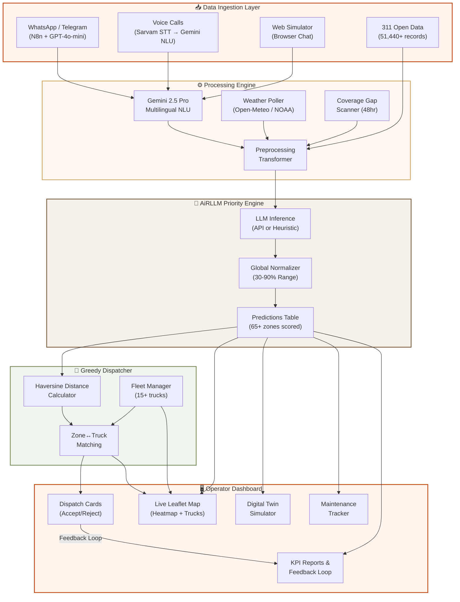

<br />
<div align="center">

# 🏙️ NagarFlow
### **The City's Brain. Predict. Dispatch. Learn.**

*AI-powered civic intelligence platform that predicts urban resource demand and optimizes real-time allocation of water tankers, garbage trucks, and maintenance teams across the Mumbai Metropolitan Region.*

[](https://nagarflow.netlify.app/)
[](#)
[](#tech-stack)
[](#tech-stack)
[](#license)

**Zero Hardware · 48‑Hour Forecast · Equity‑First Dispatch**

<br />

[Overview](#overview) · [Problem Statement](#-problem-statement) · [Architecture](#-system-architecture) · [Modules](#-10-intelligence-modules) · [Screenshots](#-screenshots) · [Tech Stack](#-tech-stack) · [Getting Started](#-getting-started) · [API Reference](#-api-reference) · [Team](#-team)

<br />

" alt="NagarFlow Landing Page — 3D city visualization with live ticker" width="100%" />

</div>

---

## Overview

**NagarFlow** is a full-stack civic intelligence platform that ingests citizen complaints from **WhatsApp**, **voice calls** (in Hindi, English, Marathi), and a **web simulator** — then routes them through an AI pipeline to prioritize zones, dispatch fleet assets, and surface actionable insights for municipal operators.

The system is built as a **decoupled monorepo** with two independently deployable services:

| Component | Technology | Role |
|:---|:---|:---|
| **Frontend** | Next.js 16, React 19, Framer Motion | Interactive dashboard with live map, dispatch cards, digital twin simulator, and 10+ operator views |
| **Backend** | Python 3.11, Flask | REST API orchestrating AI inference, NLU, fleet dispatch, weather polling, complaint ingestion, and feedback loops |
| **Database** | SQLite | Relational store with **51,440+ real MMR 311 records**, fleet state, predictions, zone coverage, agencies, and maintenance tasks |
| **AI / NLU** | Gemini 2.5 Pro, GPT-4o-mini | Multilingual complaint extraction, severity classification, and zone routing |
| **Voice** | Sarvam AI (saaras:v3 STT, bulbul:v3 TTS) | Hindi/English speech recognition, text-to-speech, and translation |
| **Automation** | N8n + WhatsApp/Telegram | Automated conversational complaint collection via messaging platforms |

---

## 🎯 Problem Statement

> **Indian municipalities lose ₹1,500+ crore annually** due to reactive, complaint-driven resource allocation. Garbage trucks visit empty zones while overflowing wards go unserved. Water tankers respond to the loudest complainers, not the driest neighborhoods.

**NagarFlow solves this** by replacing reactive dispatch with a **predictive, equity-corrected intelligence pipeline** that:

- 📊 **Forecasts demand 48 hours ahead** using historical complaint data + weather + calendar signals
- ⚖️ **Corrects systemic under-reporting bias** — low-income wards with fewer complaints get amplified priority
- 🚛 **Dispatches optimal fleet assets** via Haversine-based greedy matching to nearest idle trucks
- 🧠 **Learns from every dispatch** through a closed-loop feedback mechanism that tracks prediction error

---

## 🏗 System Architecture



**Seven-stage pipeline:** Raw Data → NLU Extraction → Preprocessing → LLM Inference → Normalization → Greedy Dispatch → Operator Action → Feedback Loop

---

## 🧠 10 Intelligence Modules

<table>
<tr>
<td width="50%">

### F01 · Equity-Corrected Demand Engine
**Poor areas served even without complaints**

Calculates expected vs actual complaints per ward. When actual < expected, priority is amplified. Systemic under-reporting in low-income wards is corrected to guarantee proportional resource dispatch.

`complaint_count × population_weight × equity_multiplier`

</td>
<td width="50%">

### F02 · Dual-Layer Map + Time Slider
**Forecast vs reality on one screen**

Live Leaflet heatmap with zone priority colors (🔴 High · 🟡 Medium · 🟢 Low) overlaid with real-time truck position markers. Priority zones pulse with urgency scoring from AiRLLM.

</td>
</tr>
<tr>
<td>

### F03 · NLP Complaint Intelligence
**Urgency, language & category from free text**

Gemini 2.5 Pro classifies incoming complaints across **Hindi, English, Marathi, and Hinglish**. Extracts zone, specific locality, issue type, severity, and generates human-like responses — all in a single unified prompt for minimum latency.

</td>
<td>

### F04 · Multi-Channel Ingestion
**WhatsApp + Voice + Web — one pipeline**

Citizens call, text, or chat. An N8n workflow handles WhatsApp/Telegram conversations via GPT-4o-mini. Voice calls use Sarvam AI STT + Gemini NLU. All channels converge into the same database schema.

</td>
</tr>
<tr>
<td>

### F05 · Predictive Surge Forecaster
**48-hour pre-positioning intelligence**

Combines historical complaint density, real-time weather from Open-Meteo (NOAA), and coverage gap signals to forecast surge demand. The AiRLLM engine uses logarithmic complaint scaling to prevent score clumping in dense wards.

</td>
<td>

### F06 · Weather Emergency Protocols
**Auto fleet reconfiguration on weather triggers**

NOAA weather poller runs every 15 minutes. WMO weather codes for rain/thunderstorm (61-99) automatically flag heavy rain. Rain status feeds directly into the AiRLLM priority formula, boosting drainage and flood-prone zones.

</td>
</tr>
<tr>
<td>

### F07 · Digital Twin Simulator
**What-if sandbox before committing resources**

Full parameter simulation: Demand increase (0-100%), Vehicle failures (0-100%), Weather severity (Clear → Extreme). Shows **Before vs After** zone grids with projected KPI deltas — no real resources committed.

</td>
<td>

### F08 · Multi-Agency Coordination Hub
**Garbage + Water + Maintenance on one board**

Unified dispatch across sanitation (garbage trucks), water supply (tankers), and maintenance teams. Truck type auto-matched to zone's dominant complaint category using historical complaint distribution analysis.

</td>
</tr>
<tr>
<td>

### F09 · Greedy Autonomous Dispatcher
**Haversine-optimized fleet routing**

Greedy algorithm pairs top-5 AiRLLM priority zones with nearest idle truck using Haversine distance (accounting for Earth's 6,371 km curvature radius). 30 km/h Mumbai street-traffic ETA calculation. Accept → truck animates along route. Arrive → zone coverage resets.

</td>
<td>

### F10 · Feedback Loop & Auto Reports
**Closed-loop prediction validation**

Every physical dispatch generates `Error = |Predicted − Actual|`. Rolling 20-prediction error average tracked. If error exceeds 25%, `MODEL RETRAINING RECOMMENDED` alert fires. KPI dashboard shows accuracy trend, coverage completion, and equity scores.

</td>
</tr>
</table>

---

## 📸 Screenshots

<div align="center">

| Landing Page | Operations Dashboard |
|:---:|:---:|
|  |  |
| *3D Three.js city · Live alert ticker · 10 feature cards* | *Leaflet heatmap · KPI cards · Haversine dispatch array* |

| Complaint Insights | Digital Twin Simulator |
|:---:|:---:|
|  |  |
| *AiRLLM breakdown · Category filters · Voice/text split* | *Demand/failure/weather sliders · Before vs After grid* |

</div>

---

## 🛠 Tech Stack

### AI & Machine Learning

| Technology | Purpose |
|:---|:---|
| **Google Gemini 2.5 Pro** | Primary NLU engine — multilingual complaint extraction, severity classification, zone routing |
| **OpenAI GPT-4o-mini** | WhatsApp/Telegram conversational agent via N8n workflow automation |
| **AiRLLM Engine** (Custom) | Priority scoring pipeline: logarithmic complaint scaling + zone stability seed + global normalization (30-90% range) |
| **Haversine Formula** | Earth-curvature-aware distance calculation for optimal truck-to-zone matching |

### Voice & Language

| Technology | Purpose |
|:---|:---|
| **Sarvam AI — saaras:v3** | Speech-to-text for Hindi, English, Marathi voice complaints |
| **Sarvam AI — bulbul:v3** | Text-to-speech for audio confirmations in native language |
| **Sarvam Translate v1** | Hindi/Devanagari → English translation for record normalization |

### Frontend

| Technology | Version | Purpose |
|:---|:---|:---|
| **Next.js** | 16.2 | App Router, SSR, API proxying |
| **React** | 19.2 | Component UI with hooks |
| **Framer Motion** | 12.x | Page transitions, micro-animations |
| **Leaflet.js** | (CDN) | Interactive map with zone heatmap and truck markers |
| **Three.js** | r128 | 3D city visualization on landing page |
| **Lucide React** | 1.7 | Icon system |
| **jsPDF + html2canvas** | Latest | Client-side PDF report generation |

### Backend & Infrastructure

| Technology | Version | Purpose |
|:---|:---|:---|
| **Python** | 3.11+ | Core backend language |
| **Flask** | Latest | REST API framework |
| **SQLite** | 3.x | Embedded relational database |
| **Open-Meteo API** | Free tier | Real-time NOAA weather data (WMO codes) |
| **N8n** | Self-hosted | WhatsApp/Telegram workflow automation |
| **ngrok** | Latest | Local tunnel for webhook development |

---

## 📂 Repository Structure

```
nagarflow/
├── README.md                     # ← You are here
├── DEPLOYMENT.md                 # Production deployment guide
├── app.py                        # 🏗  Flask API — 25+ routes, 1,600 LOC
├── .env                          # API keys (Gemini, OpenAI, Sarvam)
│
├── ── AI & Processing ──
├── airllm_engine.py              # 🧠 AiRLLM priority scoring engine
├── preprocess_transformer.py     # 📦 Cross-table data aggregator for LLM prompts
├── complaint_parser.py           # 🗣️  Gemini 2.5 Pro multilingual NLU
├── prediction_store.py           # 📊 Prediction deduplication & canonical fetch
│
├── ── Fleet & Coverage ──
├── greedy_dispatcher.py          # 🚚 Haversine-based truck↔zone matcher
├── fleet_manager.py              # 🗺️  Zone coordinates + fleet initialization
├── coverage_gap.py               # ⏱️  48-hour silent zone scanner
├── localities.py                 # 📍 34 zones × 100+ sub-localities (EN + HI)
│
├── ── Voice & Ingestion ──
├── sarvam.py                     # 🎙️  Sarvam AI STT/TTS/Translation client
├── openai_voice.py               # 🔊 OpenAI voice integration
├── ingest_data.py                # 📥 CSV → SQLite bulk complaint loader
├── weather_poller.py             # 🌧️  NOAA Open-Meteo polling (15-min cycle)
│
├── ── Data & Seeding ──
├── data/                         # 📁 51,440+ real MMR 311 complaint CSVs
├── nagarflow.db                  # 💾 Pre-loaded SQLite database
├── seed_full_demo.py             # 🌱 Demo data seeder for all tables
├── agencies_scraper.py           # 🏛️  Mumbai municipal agency directory scraper
├── areas.txt                     # 📋 Zone name reference list
│
├── ── Frontend ──
├── nagarflow-next/               # ⚛️  Next.js 16 application
│   ├── app/
│   │   ├── page.tsx              # Landing page (Three.js + 10 feature cards)
│   │   ├── layout.tsx            # Root layout with metadata
│   │   ├── globals.css           # 🎨 Design system (33KB — full theme)
│   │   ├── dashboard/            # Operations center (map + dispatch)
│   │   ├── complaints/           # Complaint insights + AiRLLM breakdown
│   │   ├── complaint-simulator/  # Browser chat complaint submission
│   │   ├── predictions/          # Zone priority scores table
│   │   ├── dispatch/             # Fleet dispatch management
│   │   ├── maintenance/          # Task tracker (PENDING → COMPLETED)
│   │   ├── simulation/           # Digital twin what-if sandbox
│   │   ├── reports/              # KPI dashboard + accuracy charts
│   │   ├── emergency/            # Per-zone weather overlay
│   │   ├── agencies/             # Municipal agency directory
│   │   ├── login/                # Auth gate
│   │   └── components/
│   │       ├── ApiRuntimeBridge.tsx   # Backend URL configuration
│   │       ├── DashboardShell.tsx     # Sidebar navigation + layout
│   │       ├── VoiceConversation.tsx  # Web mic → Sarvam STT → Gemini NLU
│   │       └── PageTransition.tsx     # Framer Motion page transitions
│   ├── package.json
│   └── netlify.toml              # Netlify deploy configuration
│
├── docs/screenshots/             # 📸 README screenshots
└── tests/                        # 🧪 Test suite
```

---

## 🚀 Getting Started

### Prerequisites

| Requirement | Version |
|:---|:---|
| Python | 3.11 or newer |
| Node.js | 18 or newer |
| API Keys | Gemini, Sarvam AI (for voice), OpenAI (for WhatsApp) |

### 1. Clone the Repository

```bash
git clone https://github.com/vinitgirdhar/nagarflow.git
cd nagarflow
```

### 2. Configure Environment

Create a `.env` file in the project root:

```env
GEMINI_API_KEY=your_gemini_api_key
OPENAI_API_KEY=your_openai_api_key          # Optional: WhatsApp pipeline
SARVAM_API_KEY=your_sarvam_api_key          # Optional: Voice agent
VAPI_WEBHOOK_SECRET=your_vapi_secret        # Optional: Telephony
AIRLLM_API_ENDPOINT=                        # Optional: Custom LLM endpoint
```

### 3. Backend Setup

```bash
# Install Python dependencies
pip install flask requests python-dotenv google-generativeai

# Initialize database + seed 51,440 complaints
python ingest_data.py

# Initialize fleet (15 trucks across MMR)
python fleet_manager.py

# Run weather poller (fetches current NOAA data)
python weather_poller.py

# Compute coverage gaps (flags zones >48hr overdue)
python coverage_gap.py

# Generate AiRLLM predictions for all 65+ zones
python airllm_engine.py

# Start the Flask API server
python app.py
# → http://127.0.0.1:5001
```

### 4. Frontend Setup

```bash
cd nagarflow-next
npm install
npm run dev
# → http://localhost:3000
```

### 5. WhatsApp / Telegram Integration *(Optional)*

```bash
# Expose backend via tunnel
ngrok http 5001

# Point your N8n HTTP node to:
# https://<ngrok-url>/api/whatsapp-complaint
```

---

## 📡 API Reference

### Complaint & Ingestion

| Method | Endpoint | Description |
|:---|:---|:---|
| `GET` | `/api/complaints` | Fetch complaints. Filters: `area`, `type`, `severity`, `limit` |
| `POST` | `/api/whatsapp-complaint` | Ingest complaint from N8n / Twilio / WhatsApp |
| `GET` | `/api/hotspots` | Locality-level complaint density clusters |

### AI & Predictions

| Method | Endpoint | Description |
|:---|:---|:---|
| `GET` | `/api/predictions` | Zone priority scores from AiRLLM engine |
| `GET` | `/api/dashboard` | Combined zone coverage + fleet status payload |

### Fleet & Dispatch

| Method | Endpoint | Description |
|:---|:---|:---|
| `GET` | `/api/dispatch` | Current Haversine-paired dispatch suggestions (top 5) |
| `POST` | `/api/dispatch/accept` | Accept dispatch: truck status → `en_route_to_{zone}` |
| `POST` | `/api/dispatch/arrive` | Mark arrived: truck → `idle`, zone → `OK`, feedback → `prediction_outcomes` |
| `POST` | `/api/simulate-surge` | Inject +35% demand spike for demo |

### Simulation & Reports

| Method | Endpoint | Description |
|:---|:---|:---|
| `GET` | `/api/simulation/baseline` | Current prediction baseline for simulator |
| `POST` | `/api/simulation/run` | Run scenario with `{demand, failures, weather}` parameters |
| `GET` | `/api/reports` | KPI summary: accuracy, coverage, equity, efficiency + chart data |

### Maintenance & Operations

| Method | Endpoint | Description |
|:---|:---|:---|
| `GET` | `/api/maintenance/data` | Tasks (auto-generated for score >80) + team roster |
| `POST` | `/api/maintenance/assign` | Assign team to task: status → `ON GROUND` |
| `POST` | `/api/maintenance/complete` | Complete task: team → `Idle`, zone → `Recently Visited` |

### Weather & Agencies

| Method | Endpoint | Description |
|:---|:---|:---|
| `GET` | `/api/weather/zones` | Per-zone temperature, AQI, wind, condition |
| `GET` | `/api/agencies` | Mumbai municipal agency directory (scraped + cached) |
| `GET` | `/api/agencies?refresh=1` | Force re-scrape agency data |

### Voice Agent

| Method | Endpoint | Description |
|:---|:---|:---|
| `POST` | `/api/agent/respond` | Voice complaint: audio → STT → Gemini NLU → TTS response |
| `POST` | `/api/agent/respond-chat` | Text complaint: text → Gemini NLU → structured response |

---

## 📊 Dashboard Pages

| Route | Page | Key Functionality |
|:---|:---|:---|
| `/` | **Landing** | 3D Three.js city, 10 feature flip-cards, pipeline visualization, live scenario demos |
| `/dashboard` | **Operations Center** | Live Leaflet map, KPI cards, zone heatmap, dispatch array, operator log |
| `/complaints` | **Complaint Insights** | Full feed with filters (urgency, category, keyword), stats bar, voice/text split |
| `/complaint-simulator` | **Chat Simulator** | Browser-based complaint submission via text/voice |
| `/predictions` | **Zone Predictions** | Priority scores table from AiRLLM engine |
| `/dispatch` | **Fleet Dispatch** | Manage and track all fleet assignments |
| `/maintenance` | **Task Tracker** | Auto-generated tasks for high-priority zones, team assignment |
| `/simulation` | **Digital Twin** | What-if sandbox with demand/failure/weather sliders |
| `/reports` | **KPI Reports** | Accuracy trends, coverage charts, feedback loop metrics |
| `/emergency` | **Weather Overlay** | Per-zone temperature, AQI, wind, flood probability |
| `/agencies` | **Agency Directory** | Mumbai municipal bodies with contact info and service categories |

---

## 🔬 How the AiRLLM Engine Works

The priority engine uses a **multi-factor scoring formula** that mimics LLM reasoning while remaining deterministic and fast:

```
Score = (log₁₀(complaints) × 10) + zone_volatility + rain_bonus + gap_penalty
```

| Factor | Weight | Description |
|:---|:---|:---|
| **Logarithmic Complaints** | `log₁₀(C) × 10` | Prevents score clumping in dense wards (Dharavi vs Colaba) |
| **Zone Stability Seed** | `±5 points` | MD5-hashed zone name → deterministic personality per ward |
| **Rain Bonus** | `+20 points` | Active when NOAA weather codes 61-99 detected |
| **Coverage Gap** | `hours/4` (max 15) | Amplifies zones >48hr since last service visit |
| **Voice Priority** | Override to `84-90` | Emergency calls bypass normal scoring |

After raw scoring, a **global normalization pass** scales all zones to a professional `30-90%` range, preventing outlier domination.

---

## 📊 Data

The database ships pre-loaded with:

| Dataset | Records | Source |
|:---|:---|:---|
| **MMR 311 Complaints** | 51,440+ | Mumbai municipal open data |
| **Zone Coverage Map** | 34 wards | Auto-seeded with visit timestamps |
| **Fleet Assets** | 15 trucks | Garbage trucks + water tankers across 4 land clusters |
| **Maintenance Teams** | 10 teams | Alpha through Juliet (Garbage, Water, Road, Drain, General) |
| **Municipal Agencies** | 10+ | Live-scraped Mumbai civic body directory |

Each complaint record includes: `zone`, `locality`, `issue_type`, `severity`, `complaint_count`, `population`, `weather`, `timestamp`, and `description`.

---

## 🗺️ Coverage Map

NagarFlow covers **34 primary zones + 40 extended wards** across the Mumbai Metropolitan Region:

> Airoli · Andheri · Bandra · Belapur · Bhayander · Borivali · CST · Chembur · Churchgate · Colaba · Dadar · Dharavi · Fort · Ghatkopar · Goregaon · Hiranandani · Jogeshwari · Juhu · Kandivali · Kurla · Lower Parel · Malad · Matunga · Mulund · Parel · Powai · Santacruz · Sion · Thane · Versova · Vikhroli · Vile Parle · Wadala · Worli

Each zone includes **verified land-only GPS coordinates** (checked against OpenStreetMap) and supports **Hindi/Devanagari aliases** for multilingual complaint routing.

---

## 🌐 Multilingual Support

NagarFlow processes complaints in:

| Language | Input Methods | Example |
|:---|:---|:---|
| **English** | Text, Voice | *"Garbage piled up near Bandra station"* |
| **Hindi** | Text, Voice | *"धारावी में कचरा पड़ा है"* |
| **Hinglish** | Text, Voice | *"Andheri mein bohot kachra jama ho gaya hai"* |
| **Marathi** | Voice | Via Sarvam AI STT auto-detection |

The NLU pipeline uses a **single unified Gemini prompt** that detects language, translates to English, extracts structured data, and generates a native-language response — all in one inference call for minimum latency.

---

## 👥 Team

<div align="center">

**Built by**

| | Name | Role |
|:---|:---|:---|
| 🧑‍💻 | **Vinit Girdhar** | Full-Stack Development & AI Architecture |
| 🧑‍💻 | **Kashmira Ghag** | Backend Engineering & Data Pipeline |
| 🧑‍💻 | **Annie Dande** | Frontend Engineering & UI/UX Design |

**Made for ITSAHACK 2026** · Smart City Platform · Municipal Intelligence Unit

</div>


---

<div align="center">

**NagarFlow** — *Nagar* (नगर, city) + *Flow* (continuous intelligence)

The city's brain. Predict. Dispatch. Learn.

`v1.0.0` · `© 2026`

</div>
